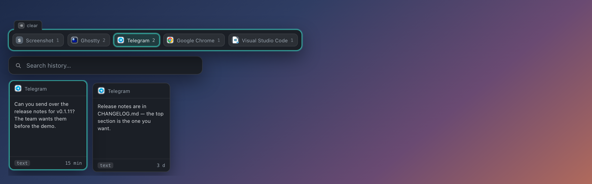
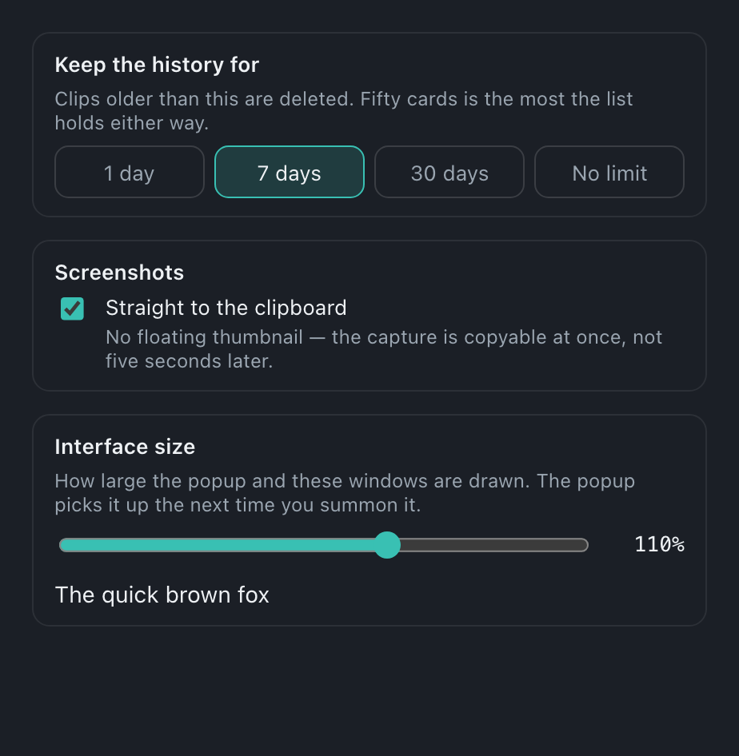

  

<h1 align="center">Iago</h1>

  Clipboard history in the menu bar. 
  <code>⌥V</code> — pick a clip, it goes straight back into the window you came from.

  <b>Screenshots land on the clipboard at once</b> — not five seconds later, once the thumbnail fades 
  <b>Everything stays local</b> — the history lives on your disk, no cloud, no telemetry

## Get it

  &nbsp;
  &nbsp;
  

Each button downloads the latest installer for that platform. Want an older build? Every version is on the [releases page](https://github.com/olegperegudov/iago/releases).

Then:

1. **Open it.** Apple isn't paid to trust us, so the first launch claims the app is *"damaged"*. It isn't — run `xattr -cr /Applications/Iago.app` once in Terminal, then open it normally. Updates after that install themselves.
2. **Grant Accessibility** when asked (System Settings → Privacy & Security → Accessibility). Without it the app cannot paste on your behalf. Once, at install — not again after every update.
3. **Press ⌥V.** The history is there.

Iago is built and used on macOS. The Windows build exists and installs, but it isn't tested nearly as much — expect rough edges.

## Everything you copied, still there

A card per clip, newest first. `⏎` or `1`…`9` — and it's back in the window you came from. Copy the same thing twice and you get one card, not two: it moves back to the front with a fresh time.

## Too many clips? Narrow to the app

The icon row on top. Step onto an app — only its clips remain. Standing on a card, `▲` goes straight to *that card's* app and turns its filter on, so `▲▼` means "more of this, please" and puts you back on the card you came from.

## Or just start typing

There is nowhere to go to search: type from wherever you are standing and the query appears above the icons, filtering from the first letter, matches marked. `⌫` takes a letter back; a card is deleted with `⌘⌫`.

## Hands stay on the keyboard

Up and down between the cards and the icons, left and right inside them. The full sheet lives in the menu-bar menu.

## Screenshots that are already on the clipboard

While macOS hangs that little thumbnail in the corner, the screenshot is not on disk yet — so pasting it right away pastes the *previous* clip. Tick **"Screenshot straight to clipboard"** in the menu bar: the file lands at once, Iago catches it, `⌘V` pastes the picture.

## Settings

Click the parrot in the menu bar → **Settings**. How long clips are kept (a day, a week, a month, or no limit — a week by default), whether a screenshot lands on the clipboard at once, and how large the interface is drawn.

## Updates

The parrot in the menu bar turns green when a new version is out. Click it, pick the update line — done.

## Privacy

- Clips never leave the machine — no cloud, no sync, no telemetry.
- **Passwords are not recorded.** A password manager marks what it copies as concealed; Iago drops those clips instead of filing them.
- **Clips expire.** A week by default — change it in Settings, or turn expiry off if you would rather keep them.
- The history is stored unencrypted, but the files are readable only by your user account — not by anything else running on the machine.

## Under the hood

Stack, local build, tests, signing and the release pipeline → [docs/DEVELOPMENT.md](docs/DEVELOPMENT.md).

## License

MIT
