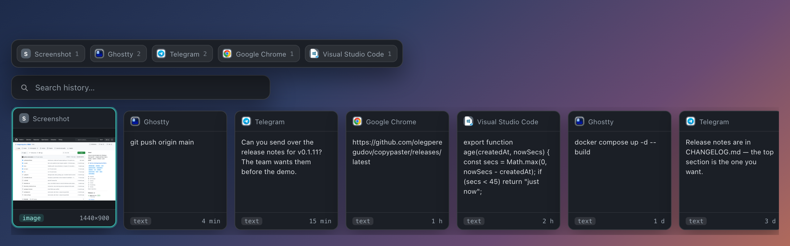
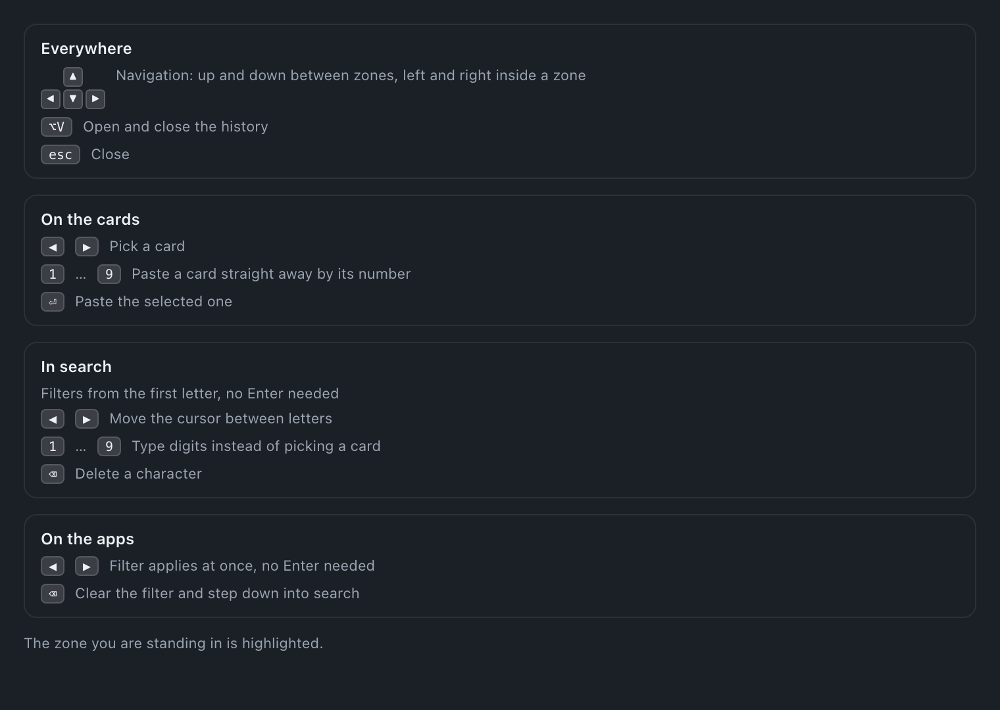

<p align="center">
  
</p>

<h1 align="center">CopyPaster</h1>

<p align="center">
  Clipboard history in the macOS menu bar.<br/>
  <code>⌥V</code> — cards of your recent clips, live search, a filter by app, and a paste back into the window you came from.
</p>

<p align="center">
  <b>Screenshots land in the clipboard at once</b> — not five seconds later, while the floating thumbnail fades<br/>
  <b>Everything stays local</b> — the history lives on your disk, no cloud, no telemetry
</p>

## What it looks like

`⌥V` — the history floats over whatever you were doing: a card per clip, the source app on the head, the age on the foot.



Type, and it narrows from the first letter — matches marked, the app row collapsing to the apps that still have something to show.


## Install (macOS)

1. Download the DMG from the [Releases](https://github.com/olegperegudov/copypaster/releases/latest) page — `aarch64` for Apple Silicon, `x64` for Intel.
2. Drag CopyPaster into Applications and open it with **right click → Open** (the app is not notarized with Apple).
3. Grant **Accessibility** (System Settings → Privacy & Security → Accessibility). Without it the app cannot paste on your behalf.

Updates arrive on their own: the menu-bar icon turns green and its menu offers "Update to vX.Y.Z".

## How to use it

`⌥V` raises the history over your screen. Three zones, two axes:

- **Up and down** — between zones: cards → search → apps.
- **Left and right** — inside the zone where the cursor stands.

| Where | Keys |
|---|---|
| Cards | `←` `→` select, `⏎` paste, `1`…`9` paste by number |
| Search | filters from the first letter, no Enter needed; `←` `→` move the cursor between letters |
| Apps | `←` `→` apply the filter at once; `⌫` clears it and takes you down into search |
| Everywhere | `esc` closes |

The full cheat sheet lives in the icon menu, under "Shortcuts". It highlights the zone you are standing in: the same key does different things in different zones — digits pick a card, while in search they simply get typed.



## Instant screenshots

Shift-Cmd-4 does not put an image on the clipboard: it saves a file. While the floating thumbnail sits in the corner, that file is not on disk yet — macOS writes it only once the thumbnail fades, and that takes about five seconds. All that time "copy the screenshot" pastes the previous clip.

The menu item **"Screenshot straight to clipboard (no thumbnail)"** turns that thumbnail off. The file then lands on disk immediately, CopyPaster catches it through a filesystem event, and the image ends up both in the history and on the clipboard — a plain `⌘V` pastes exactly it. The card takes over the role of the preview.

## Development

```bash
npm install
npm run tauri dev                  # run it
npm test                           # search, filtering and highlighting tests
cd src-tauri && cargo test --lib   # history tests
```

Every push to `main` is a release: CI bumps the patch version itself, builds macOS (Apple Silicon and Intel separately) and Windows, then publishes the release and the auto-update manifest.

The current session log: `~/Library/Application Support/copypaster/debug.log`.

## Stack

Tauri 2 — Rust on the outside, HTML/CSS/JS on the inside, one codebase for macOS and Windows. The same rails as [Ribbit](https://github.com/olegperegudov/ribbit) and [Quill](https://github.com/olegperegudov/quill): a shared build, signing and update pipeline across all three apps.

## License

MIT.
